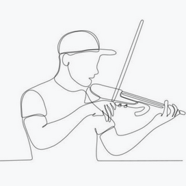

### Introduction

🤣 This is my first ever, _nicely-written_ **README-file.** 🤣\
~~(OOps, maybe I shouldn't even have mentioned that.~~\
BUT:\
My motto is: \ > Do. Or do not. There is no try.\
SO:\
I'm Márta Kapocs, from Diósd, a small town near Budapest, the capital of Hungary.\
I live with my husband and 4 children:
- Bálint 
- Hanna
- Bence
- Ilka
All 4 of them have something to do with music (ie. have performed at prestigious concert halls in Budapest and some in Europe). Now two of them are university students, one is going to be a professional musician and one is still studying at an elementary school.
